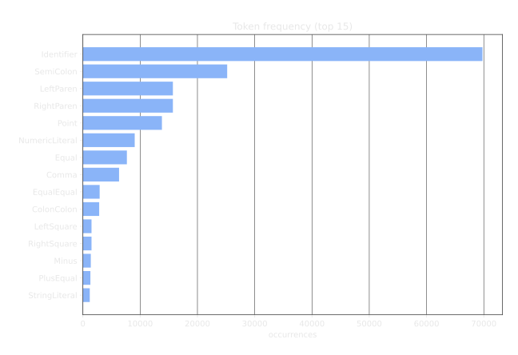
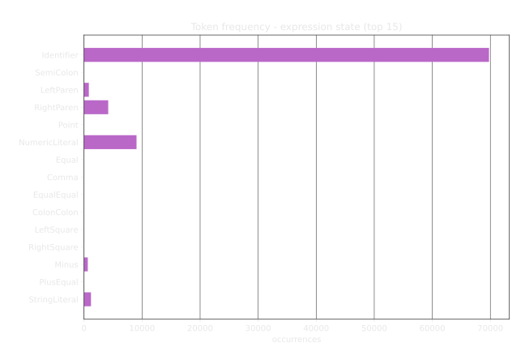
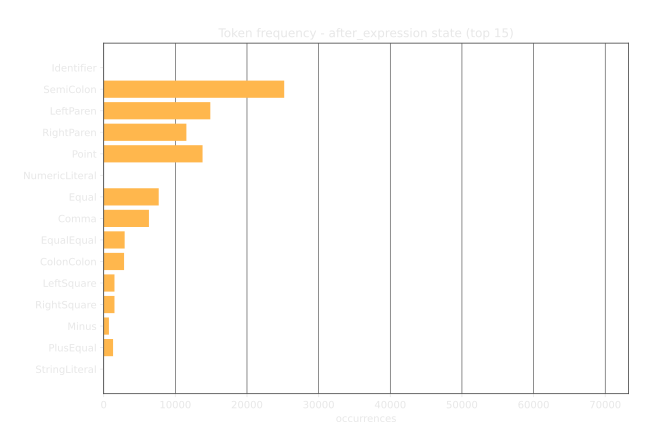
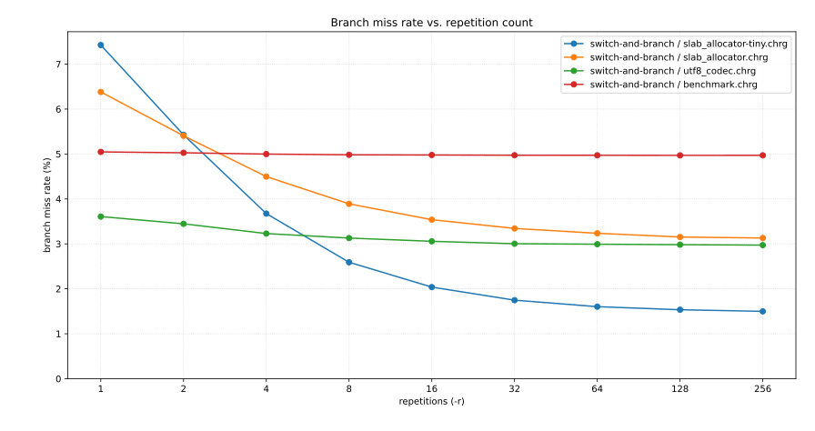

<!-- .slide: data-background-image="assets/title.png" data-background-size="contain" -->

---

## Parsers

* <!-- .element: class="fragment" --> Specific context: programming languages
* <!-- .element: class="fragment" --> Transforms source code into AST
* <!-- .element: class="fragment" --> Done in two steps, lexing then parsing
* <!-- .element: class="fragment" --> Used by: compilers, language servers, formatters, ...

---

## Motivation

* Parser and lexer for <!-- .element: class="fragment" --> [Torbenx/charge](https://github.com/Torbenx/charge)
* &#32; <!-- .element: class="fragment" --> [Carbon Compiler Design](https://www.youtube.com/watch?v=ZI198eFghJk) at C++Now 2023
  * Challenge: Parse and lex at 10M lines/sec
  * Combined at 5M lines/sec
* &#32; <!-- .element: class="fragment" --> [Reported hit](https://www.youtube.com/watch?v=hN6KcAKfTN0) at NDC Toronto 2026 on Apple M4
  * Lex at 12M lines/sec
  * Parse+Lex at 7M lines/sec

---
<!-- .slide: data-auto-animate -->

## Lexing

* <!-- .element: class="fragment" --> Breaks input into tokens
  * <!-- .element: class="fragment" --> Identifiers
  * <!-- .element: class="fragment" --> Operators
  * <!-- .element: class="fragment" --> Literals
* <!-- .element: class="fragment" --> Context independent
* <!-- .element: class="fragment" --> Alphabet for parsers

&nbsp;

<div class="token-code-1 fragment">
<code data-id="token-1">conference</code>&nbsp;
<code data-id="token-2">=</code>&nbsp;
<code data-id="token-3">"CppCon"</code>&nbsp;
<code data-id="token-4">+</code>&nbsp;
<code data-id="token-5">to_string</code>
<code data-id="token-6">(</code>
<code data-id="token-7">2026</code>
<code data-id="token-8">)</code>
</div>

--
<!-- .slide: data-auto-animate -->

## Lexing

* Breaks input into tokens
  * Identifiers
  * Operators
  * Literals
* Context independent
* Alphabet for parsers

&nbsp;

<div class="token-code-2">
<code data-id="token-1">conference</code>&nbsp;
<code data-id="token-2">=</code>&nbsp;
<code data-id="token-3">"CppCon"</code>&nbsp;
<code data-id="token-4">+</code>&nbsp;
<code data-id="token-5">to_string</code>
<code data-id="token-6">(</code>
<code data-id="token-7">2026</code>
<code data-id="token-8">)</code>
</div>

---
<!-- .slide: data-auto-animate data-auto-animate-restart -->

## Parsing

* <!-- .element: class="fragment" --> Consumes a token stream
* <!-- .element: class="fragment" --> Validates syntax against grammar
* <!-- .element: class="fragment" --> Recognizes contextual meaning of tokens
* <!-- .element: class="fragment" --> Outputs a parse tree or AST

&nbsp;

<div class="token-code-2 fragment">
<code data-id="token-1">conference</code>
<code data-id="token-2">=</code>
<code data-id="token-3">"CppCon"</code>
<code data-id="token-4">+</code>
<code data-id="token-5">to_string</code>
<code data-id="token-6">(</code>
<code data-id="token-7">2026</code>
<code data-id="token-8">)</code>
</div>

--

<!-- .slide: data-auto-animate -->

## Parsing

* Consumes a token stream
* Validates syntax against grammar
* Recognizes contextual meaning of tokens
* Outputs a parse tree or AST

<div class="ast-tree">
<code data-id="token-2" style="grid-area:1/33/auto/span 2">=</code>
<code data-id="token-1" style="grid-area:2/12/auto/span 2">conference</code>
<code data-id="token-4" style="grid-area:2/54/auto/span 2">+</code>
<code data-id="token-3" style="grid-area:3/36/auto/span 2">"CppCon"</code>
<code data-id="token-6" style="grid-area:3/72/auto/span 2">(</code>
<code data-id="token-8" style="grid-area:3/72/auto/span 2;opacity:0">)</code>
<code data-id="token-5" style="grid-area:4/60/auto/span 2">to_string</code>
<code data-id="token-7" style="grid-area:4/84/auto/span 2">2026</code>
<svg data-id="ast-edges" class="ast-edges" viewBox="0 0 100 100" preserveAspectRatio="none"><line x1="34.375" y1="12.5" x2="12.5" y2="37.5"/><line x1="34.375" y1="12.5" x2="56.25" y2="37.5"/><line x1="56.25" y1="37.5" x2="37.5" y2="62.5"/><line x1="56.25" y1="37.5" x2="75" y2="62.5"/><line x1="75" y1="62.5" x2="62.5" y2="87.5"/><line x1="75" y1="62.5" x2="87.5" y2="87.5"/></svg>
</div>

---

## Main Loop

```c++ [|1,12|2,3|4,10|5-8|11|]
for (;;) {
    sourcePosition = skipWhitespace(sourcePosition);
    Token tok = Token::Invalid;
    switch (sourcePosition[0]) {
    case ',':
        tok = Token::Comma;
        sourcePosition += 1;
        break;
    ...
    }
    output.emitToken(tok, /* source-information */);
}
```
<!-- .element: class="fragment" -->

---

<!-- .slide: data-auto-animate -->
## `+` Tokens

```c++ [|1,2|3-5|6-8|9-12|]
case '+':
    // Tokens: ++ += +
    if (sourcePosition[1] == '+') {
        tok = Token::PlusPlus;
        sourcePosition += 2;
    } else if (sourcePosition[1] == '=') {
        tok = Token::PlusEqual;
        sourcePosition += 2;
    } else {
        tok = Token::Plus;
        sourcePosition += 1;
    }
    break;
```
<!-- .element: data-id="code-block" style="width: 800px;" -->

--

<!-- .slide: data-auto-animate -->
## `+` Tokens

```c++ [0: |16]
switch (sourcePosition[0]) {
case '+':
    // Tokens: ++ += +
    if (sourcePosition[1] == '+') {
        tok = Token::PlusPlus;
        sourcePosition += 2;
    } else if (sourcePosition[1] == '=') {
        tok = Token::PlusEqual;
        sourcePosition += 2;
    } else {
        tok = Token::Plus;
        sourcePosition += 1;
    }
    break;
}
output.emitToken(tok, /* source-information */);
```
<!-- .element: data-id="code-block" style="width: 800px;" -->

---

## String Literals

```c++ [|1|2|3,4|]
case '"':
    tok = Token::StringLiteral;
    sourcePosition = skipStringLiteral(sourcePosition);
    sourcePosition += 1;
    break;
```

<span class="fragment">Note: No processing / unescaping</span>

---

## `/` Tokens And Comments

```c++ [|2-6|7-10|11-13|14-17|]
case '/':
    if (sourcePosition[1] == '*') {
        sourcePosition = skipBlockComment(sourcePosition + 2);
        sourcePosition += 2;
        output.recordComment(CommentKind::Block, /* source-information */);
        continue;
    } else if (sourcePosition[1] == '/') {
        sourcePosition = skipToEndOfLine(sourcePosition + 2);
        output.recordComment(CommentKind::Line, /* source-information */);
        continue;
    } else if (sourcePosition[1] == '=') {
        tok = Token::SlashEqual;
        sourcePosition += 2;
    } else {
        tok = Token::Slash;
        sourcePosition += 1;
    }
    break;
```

---

## Identifiers

* <!-- .element: class="fragment" --> Key decision: identifier table or not
* <!-- .element: class="fragment" --> Extremely useful for compilers
* <!-- .element: class="fragment" --> Very hash table heavy
  * [Matt Kulukundis at CppCon 2017](https://www.youtube.com/watch?v=ncHmEUmJZf4)
  * [Malte Skarupke at C++Now 2018](https://www.youtube.com/watch?v=M2fKMP47slQ)
* <!-- .element: class="fragment" --> Focus on formatters
  * Need keyword recognition only

--

## Identifiers

```c++ [|1-3|4,5|6,7|]
case 'A'..='Z':
case 'a'..='z':
case '_':
    const char* begin = sourcePosition;
    sourcePosition = skipIdentifier(sourcePosition + 1);
    auto* entry = KeywordTable::get(begin, sourcePosition);
    tok = entry ? entry->token : Token::Identifier;
    break;
```
<span class="fragment"><code>KeywordTable</code> generated by <code>gperf</code></span>

---

## Switch And Branch Summary

* <!-- .element: class="fragment" --> Branches for:
  <pre class="fragment"><code data-trim class="language-cpp">
    ( ) [ ] { } ~ . , : ; + - * / % ^ ! & | < > =
    :: ++ -- && || << >> ==
    += -= *= /= %= ^= != &= |= <= >=
    &&= ||= <<= >>=
    -> =>
    // /*
  </code></pre>

  * <!-- .element: class="fragment" --> Integer, string and character literals
  * <!-- .element: class="fragment" --> Identifiers / keywords
  * <!-- .element: class="fragment" --> New lines and null terminator
* <!-- .element: class="fragment" --> 30 switch cases and 58 total branches

---

<!-- .slide: data-auto-animate -->
## Benchmark Setup

```c++ [|1|3-11|4|6-10|3-11]
const char* lexSwitchAndBranch(const char* sourcePosition, LexerOutput& output);

void runGoogleBenchmark(benchmark::State& state, std::string file) {
    std::string source = readFile(file);

    for (auto _ : state) {
        LexerOutput output { source };
        const char* end = lexSwitchAndBranch(source.data(), output);
        assert(end == source.data() + source.size());
    }
}
```
<!-- .element: data-id="code-block" style="width: 1200px;" -->

--

<!-- .slide: data-auto-animate -->
## Benchmark Setup

```c++ [3-24|12-16|18-23]
const char* lexSwitchAndBranch(const char* sourcePosition, LexerOutput& output);

void runGoogleBenchmark(benchmark::State& state, std::string file) {
    std::string source = readFile(file);

    for (auto _ : state) {
        LexerOutput output { source };
        const char* end = lexSwitchAndBranch(source.data(), output);
        assert(end == source.data() + source.size());
    }

    LexerOutput output { source };
    lexSwitchAndBranch(source.data(), output);
    auto bytes = source.size();
    auto lines = output.lines.size();
    auto tokens = output.tokens.size();

    state.counters["bytes"] = benchmark::Counter(
        bytes, benchmark::Counter::kIsIterationInvariantRate);
    state.counters["lines"] = benchmark::Counter(
        lines, benchmark::Counter::kIsIterationInvariantRate);
    state.counters["tokens"] = benchmark::Counter(
        tokens, benchmark::Counter::kIsIterationInvariantRate);
}
```
<!-- .element: data-id="code-block" style="width: 1200px;" -->

---

## Switch And Branch Benchmark

<aside class="notes">COMMAND: ./build/charge gbench --benchmark_filter=benchmarkImpl/switch-and-branch</aside>
<aside class="notes">COMMAND: ./benchmark.bash switch-and-branch</aside>

* <!-- .element: class="fragment" --> 50000 lines of AI-generated input data <!-- 1M AI tokens -->
* <!-- .element: class="fragment" --> About 15.5M lines/sec
* <!-- .element: class="fragment" --> At 220 (user space) cycles/line <aside class="notes">220 * 15.5 = 3.41 GHz</aside>
  * <!-- .element: class="fragment" --> Doesn't measure syscalls
  * <!-- .element: class="fragment" --> Doesn't measure custom allocator

---

## What To Optimize

* <!-- .element: class="fragment" --> <code>skipIdentifier</code> and friends &nbsp;&longrightarrow;&nbsp; SIMD
* <!-- .element: class="fragment" --> Identifier table &nbsp;&longrightarrow;&nbsp; hash table
* <!-- .element: class="fragment" --> Token recognition &nbsp;&longrightarrow;&nbsp; branch heavy
  * `token-begin` &nbsp;&longmapsto;&nbsp; `(token-enum, advance)`

---
<!-- .slide: data-auto-animate -->

## How To Reduce Branches

* <!-- .element: class="fragment" --> Completely branchless is impractical
  * Many different `skip` functions
* <!-- .element: class="fragment" --> Reduce as much as possible
  * One case per `skip` function
  * Plus one case for punctuations
* <!-- .element: class="fragment" --> Need to recognize all of:
```c++
( ) [ ] { } ~ . , : ; + - * / % ^ ! & | < > =
:: ++ -- && || << >> ==
+= -= *= /= %= ^= != &= |= <= >=
&&= ||= <<= >>=
-> =>
// /*
```
<!-- .element: class="fragment" data-id="code-block" -->

---
<!-- .slide: data-auto-animate -->

## 3-Character Lookup Table

```c++
( ) [ ] { } ~ . , : ; + - * / % ^ ! & | < > =
:: ++ -- && || << >> ==
+= -= *= /= %= ^= != &= |= <= >=
&&= ||= <<= >>=
-> =>
// /*
```
<!-- .element: data-id="code-block" -->

* <!-- .element: class="fragment" --> Max punctuation length is 3
* <!-- .element: class="fragment" --> <code>256 * 256 * 256 * 1 byte per entry</code>
* <!-- .element: class="fragment" --> <code>= 16 MiB</code> in total
* <!-- .element: class="fragment" --> Larger than L3 cache

---
<!-- .slide: data-auto-animate -->

## Exploit Token Shapes

```c++
( ) [ ] { } ~ . , : ; + - * / % ^ ! & | < > =
:: ++ -- && || << >> ==
+= -= *= /= %= ^= != &= |= <= >=
&&= ||= <<= >>=
-> =>
// /*
```
<!-- .element: data-id="code-block" -->

* <!-- .element: class="fragment" --> Punctuations can be:
  * <!-- .element: class="fragment" --> A single character
  * <!-- .element: class="fragment" --> A character repeated twice
  * <!-- .element: class="fragment" --> A character followed by <code>'='</code>
  * <!-- .element: class="fragment" --> A character repeated twice followed by <code>'='</code>
  * <!-- .element: class="fragment" --> A character followed by <code>'>'</code>
  * <!-- .element: class="fragment" --> <code>/*</code>

---
<!-- .slide: data-auto-animate data-auto-animate-restart -->

## Implementation

```c++ [|1,2|4|5,6|7,8|10,11|13|14-17|18-21|22|23-25|27|]
for (;;) {
    sourcePosition = skipWhitespace(sourcePosition);

    bool repeat = sourcePosition[1] == sourcePosition[0];
    int equalTestOffset = repeat ? 2 : 1;
    bool equal = sourcePosition[equalTestOffset] == '=';
    char extraTestCharacter = sourcePosition[0] == '/' ? '*' : '>';
    bool extra = sourcePosition[1] == extraTestCharacter;

    auto [tok, advance] = lookup(sourcePosition[0],
                                 repeat, equal, extra);

    switch (tok) {
    case LINE_COMMENT_PLACEHOLDER:
        sourcePosition = skipToEndOfLine(sourcePosition + 2);
        output.recordComment(CommentKind::Line, /* source-information */);
        continue;
    case Token::StringLiteral:
        sourcePosition = skipStringLiteral(sourcePosition);
        sourcePosition += 1;
        break;
    ...
    default:
        sourcePosition += advance;
        break;
    }
    output.emitToken(tok, /* source-information */);
}
```
<!-- .element: data-id="code-block" style="width: 1100px;" -->

--

<!-- .slide: data-auto-animate -->
## Implementation

```c++ [|2,3|7-10|11|]
struct Entry {
    Token token : 6;
    uint8_t advance : 2;
};

Entry lookup(char character, bool repeat, bool equal, bool extra) {
    size_t index = (size_t)character
                   | ((size_t)repeat << 7)
                   | ((size_t)equal << 8)
                   | ((size_t)extra << 9);
    return table[index];
}
```
<!-- .element: style="width: 1100px;" -->

***

```c++ [4:]
    bool repeat = sourcePosition[1] == sourcePosition[0];
    int equalTestOffset = repeat ? 2 : 1;
    bool equal = sourcePosition[equalTestOffset] == '=';
    char extraTestCharacter = sourcePosition[0] == '/' ? '*' : '>';
    bool extra = sourcePosition[1] == extraTestCharacter;

    auto [tok, advance] = lookup(sourcePosition[0],
                                 repeat, equal, extra);
```
<!-- .element: data-id="code-block" style="width: 1100px;" -->

---

## Pattern Table Summary

* <!-- .element: class="fragment" --> 10 switch cases
* <!-- .element: class="fragment" --> Table size is <code>128 * 2 * 2 * 2 = 1024</code>
* <!-- .element: class="fragment" --> Lots of instructions
* <!-- .element: class="fragment" --> Dependence between instructions

--

## Pattern Table Benchmark

<aside class="notes">COMMAND: ./benchmark.bash "switch-and-branch|pattern-table"</aside>

* <!-- .element: class="fragment" --> 12.7M vs 15.5M lines/sec
* <!-- .element: class="fragment" --> 281 vs 220 cycles/line
* <!-- .element: class="fragment" --> Fewer branches (- 280k / - 7.9%)
* <!-- .element: class="fragment" --> Fewer misses (- 9.9k / - 5.6%)
* <!-- .element: class="fragment" --> Slightly higher miss rate (+ 0.12%)

--

## On Randomized Tokens

<aside class="notes">COMMAND: ./benchmark-random.bash "switch-and-branch|pattern-table"</aside>

* <!-- .element: class="fragment" --> 35% vs 42% drop in throughput
* <!-- .element: class="fragment" --> 65% vs 91% increase in cycles
* <!-- .element: class="fragment" --> Branch miss rate 14% vs 15.2% (- 1.2%)
* <!-- .element: class="fragment" --> Real source code is not random
  * <!-- .element: class="fragment" --> Syntax
  * <!-- .element: class="fragment" --> Conventions
  * <!-- .element: class="fragment" --> Readability
  * <!-- .element: class="fragment" --> ...

---

## Expression Language

* <!-- .element: class="fragment" --> Consider grammar consisting of only expressions
  <div class="fragment">

  `now = startTime + index(slide) * avgSlideDur;`

  `avg[i] = (data[i] + data[i + 1]) / 2;`

  </div>

<div style="display: flex;">

<div style="flex: 1;" class="fragment">

We have:
* <!-- .element: class="fragment" --> Binary, unary, postfix operators
* <!-- .element: class="fragment" --> Call, index expressions
* <!-- .element: class="fragment" --> Parentheses
* <!-- .element: class="fragment" --> Member access

</div>
<div style="flex: 1;" class="fragment">

But not:
* <!-- .element: class="fragment" --> If statements
* <!-- .element: class="fragment" --> Loops
* <!-- .element: class="fragment" --> Functions
* <!-- .element: class="fragment" --> Declarations

</div>

</div>

--

## Expression Language

Two parsing states<br>when ignoring precedence <!-- .element: class="fragment" -->

<div style="display: flex;">

<div style="flex: 1;" class="fragment">

Expression:
* <!-- .element: class="fragment" --> Identifiers, Literals
* <!-- .element: class="fragment" --> Parentheses
* <!-- .element: class="fragment" --> Unary operators

</div>
<div style="flex: 1;" class="fragment">

After expression:
* <!-- .element: class="fragment" --> Binary operators
* <!-- .element: class="fragment" --> Postfix operators
* <!-- .element: class="fragment" --> Calls

</div>

</div>

---
<!-- .slide: data-auto-animate data-auto-animate-restart -->

## Token Frequency


<!-- .element: data-id="image" -->

--
<!-- .slide: data-auto-animate -->

## Token Frequency


<!-- .element: data-id="image" -->

--
<!-- .slide: data-auto-animate -->

## Token Frequency


<!-- .element: data-id="image" -->

---
<!-- .slide: data-auto-animate -->

## Implementation

```c++ []
for (;;) {
    sourcePosition = skipWhitespace(sourcePosition);
    Token tok = Token::Invalid;
    switch (sourcePosition[0]) {
    case ',':
        tok = Token::Comma;
        sourcePosition += 1;
        break;
    ...
    }
    output.emitToken(tok, /* source-information */);
}
```
<!-- .element: data-id="code-block" style="width: 800px;" -->

--
<!-- .slide: data-auto-animate -->

## Implementation

```c++ [|1,2|6-14|4,5|]
Token tok = Token::Invalid;
goto loop$no_emit;
{
loop$with_emit:
    output.emitToken(tok, /* source-information */);
loop$no_emit:
    sourcePosition = skipWhitespace(sourcePosition);
    switch (sourcePosition[0]) {
    case ',':
        tok = Token::Comma;
        sourcePosition += 1;
        goto loop$with_emit;
    ...
    }
}
```
<!-- .element: data-id="code-block" style="width: 800px;" -->

--

## Implementation

```c++ [|4,6,16,18|1,2,6|6-12|18-24|]
Token tok = Token::Invalid;
goto expression$no_emit;
{
expression$with_emit:
    output.emitToken(tok, /* source-information */);
expression$no_emit:
    sourcePosition = skipWhitespace(sourcePosition);
    switch (sourcePosition[0]) {
    case ',':
        tok = Token::Comma;
        sourcePosition += 1;
        goto error;
    ...
    }

after_expression$with_emit:
    output.emitToken(tok, /* source-information */);
after_expression$no_emit:
    sourcePosition = skipWhitespace(sourcePosition);
    switch (sourcePosition[0]) {
    case ',':
        tok = Token::Comma;
        sourcePosition += 1;
        goto expression$with_emit;
    ...
    }
}
```

---

## `+` Tokens

```c++ [|1,2|3-6|7-10|11-15|17,18|19-22|23-26|27-31|]
// expression
case '+':
    if (sourcePosition[1] == '+') {
        tok = Token::PlusPlus;
        sourcePosition += 2;
        goto expression$with_emit; // ++a
    } else if (sourcePosition[1] == '=') {
        tok = Token::PlusEqual;
        sourcePosition += 2;
        goto error; // += a
    } else {
        tok = Token::Plus;
        sourcePosition += 1;
        goto expression$with_emit; // +a
    }

// after_expression
case '+':
    if (sourcePosition[1] == '+') {
        tok = Token::PlusPlus;
        sourcePosition += 2;
        goto after_expression$with_emit; // a++
    } else if (sourcePosition[1] == '=') {
        tok = Token::PlusEqual;
        sourcePosition += 2;
        goto expression$with_emit; // a += b
    } else {
        tok = Token::Plus;
        sourcePosition += 1;
        goto expression$with_emit; // a + b
    }
```

---

## `/` Tokens And Comments

```c++ [|1,2|3-7|8-11|12-15|16-20|22,23|24-28|29-32|33-36|37-41|]
// expression
case '/':
    if (sourcePosition[1] == '*') {
        sourcePosition = skipBlockComment(sourcePosition + 2);
        sourcePosition += 2;
        output.recordComment(CommentKind::Block, /* source-information */);
        goto expression$no_emit;
    } else if (sourcePosition[1] == '/') {
        sourcePosition = skipToEndOfLine(sourcePosition + 2);
        output.recordComment(CommentKind::Line, /* source-information */);
        goto expression$no_emit;
    } else if (sourcePosition[1] == '=') {
        tok = Token::SlashEqual;
        sourcePosition += 2;
        goto error; // /= a
    } else {
        tok = Token::Slash;
        sourcePosition += 1;
        goto error; // / a
    }

// after_expression
case '/':
    if (sourcePosition[1] == '*') {
        sourcePosition = skipBlockComment(sourcePosition + 2);
        sourcePosition += 2;
        output.recordComment(CommentKind::Block, /* source-information */);
        goto after_expression$no_emit;
    } else if (sourcePosition[1] == '/') {
        sourcePosition = skipToEndOfLine(sourcePosition + 2);
        output.recordComment(CommentKind::Line, /* source-information */);
        goto after_expression$no_emit;
    } else if (sourcePosition[1] == '=') {
        tok = Token::SlashEqual;
        sourcePosition += 2;
        goto expression$with_emit; // a /= b
    } else {
        tok = Token::Slash;
        sourcePosition += 1;
        goto expression$with_emit; // a / b
    }
```

---

## 2-State Summary

* <!-- .element: class="fragment" --> Two copies of switch and branch
* <!-- .element: class="fragment" --> Differ only in goto targets
* <!-- .element: class="fragment" --> Better branch prediction
* <!-- .element: class="fragment" --> Theoretically same instructions
  * <!-- .element: class="fragment" --> Cannot be slower?

--

## 2-State Benchmark

<aside class="notes">COMMAND: ./benchmark-expr.bash "switch-and-branch|expr-1state|expr-2state"</aside>

* <!-- .element: class="fragment" --> Different benchmark data
* <!-- .element: class="fragment" --> 16.2M vs 17.1M lines/sec
* <!-- .element: class="fragment" --> 1-State identical to Switch And Branch
* <!-- .element: class="fragment" --> More instructions (+ 1.36M / + 11.4%)
* <!-- .element: class="fragment" --> More branches (+ 0.10M / + 4.9%)
* <!-- .element: class="fragment" --> Fewer misses (- 4.0k / - 3.4%)
* <!-- .element: class="fragment" --> Lower miss rate (- 0.44%)

--

## What Went Wrong

* <!-- .element: class="fragment" --> Breaks conditional moves
* <!-- .element: class="fragment" --> Larger function
  * <!-- .element: class="fragment" --> Worse codegen decisions
  * <!-- .element: class="fragment" --> More register pressure

---

## Why Continue In This Direction

* <!-- .element: class="fragment" --> Can we validate everything?
* <!-- .element: class="fragment" --> What happens for a real grammar?
* <!-- .element: class="fragment" --> Applicable grammars?

---

## Validate Everything

* <!-- .element: class="fragment" --> <code>','</code> is only valid in some contexts
* <!-- .element: class="fragment" --> Need to match <code>'('</code> and <code>')'</code>
* <!-- .element: class="fragment" --> Solution: Add a scope stack

--
<!-- .slide: data-auto-animate -->

## Validate Everything

```c++ []
// after_expression
case '(':
    tok = Token::LeftParen;
    sourcePosition += 1;
    goto expression$with_emit;
case ',':
    tok = Token::Comma;
    sourcePosition += 1;
    goto expression$with_emit;
case ')':
    tok = Token::RightParen;
    sourcePosition += 1;
    goto after_expression$with_emit;
```
<!-- .element: data-id="code-block" -->

--
<!-- .slide: data-auto-animate -->

## Validate Everything

```c++ [|2,3|7,8|12,13|]
// after_expression
case '(':
    scopeStack.push(Scope::Call);
    tok = Token::LeftParen;
    sourcePosition += 1;
    goto expression$with_emit;
case ',':
    scopeStack.test(Scope::Call);
    tok = Token::Comma;
    sourcePosition += 1;
    goto expression$with_emit;
case ')':
    scopeStack.pop(Scope::Call);
    tok = Token::RightParen;
    sourcePosition += 1;
    goto after_expression$with_emit;
```
<!-- .element: data-id="code-block" -->

---

## Real Grammar

* <!-- .element: class="fragment" --> Needs to be predictable: Template or comparison?
  * <!-- .element: class="fragment" --> Rust: Inferred or Turbofish
    ```rust
    let a: Vec<i32> = Vec::new();
    let b = Vec::<i32>::new();
    ```
  * <!-- .element: class="fragment" --> Carbon: Explicit <code>()</code> or implicit <code>[]</code>
    ```carbon
    fn Sort[T: Comparable](ref v: Vector(T));
    ```
  * <!-- .element: class="fragment" --> Cpp2: Whitespace sensitive
    ```cpp
    f<int>(c);   // template
    a<b;         // comparison
    a <b>(c);    // comparison chain -> error
    ```
  * <!-- .element: class="fragment" --> Charge: Braces
    ```rust
    let a: vector{int} = ();
    let b = vector{int}();
    ```

--

## Real Grammar

* <!-- .element: class="fragment" --> Need an abstraction

```txt [|1|2,5,9|3,6,10|4,7,11|]
SwitchState expression() then error
    punctuation +
        emitToken PlusExpr
        next expression
    punctuation ++
        emitToken PreIncrementExpr
        next expression

    identifier
        emitToken IdentifierExpr
        next after_expression
```
<!-- .element: class="fragment" -->

---

## Walkthrough

<div style="display: flex;">

<div style="flex-basis: 220px" class="example-left">

<pre class="walkthrough-source" style="width: 100%;"><code class="hljs nohighlight" data-noescape><span class="fragment custom tok hljs-keyword" data-fragment-index="300">struct</span> <span class="fragment custom tok hljs-class" data-fragment-index="400"><span class="hljs-title">Foo</span></span><span class="fragment custom tok" data-fragment-index="500">:</span> <span class="fragment custom tok" data-fragment-index="600">{</span>
    <span class="fragment custom tok" data-fragment-index="700">bar</span><span class="fragment custom tok" data-fragment-index="800">:</span> <span class="fragment custom tok hljs-type" data-fragment-index="900">int</span><span class="fragment custom tok" data-fragment-index="1000">;</span>
<span class="fragment custom tok" data-fragment-index="1500">}</span><span class="fragment custom tok tok-eos" data-fragment-index="1900"></span></code></pre>

<div class="r-stack example-stacks">

```txt
```

```txt
Start
```
<!-- .element: class="fragment" data-fragment-index="2" -->

```txt
Start
Namespace
```
<!-- .element: class="fragment" data-fragment-index="3" -->

```txt
Start
Namespace
Struct
```
<!-- .element: class="fragment" data-fragment-index="502" -->

```txt
Start
Namespace
Struct
VariableType
```
<!-- .element: class="fragment" data-fragment-index="702" -->

```txt
Start
Namespace
Struct
```
<!-- .element: class="fragment" data-fragment-index="903" -->

```txt
Start
Namespace
```
<!-- .element: class="fragment" data-fragment-index="1402" -->

```txt
Start
```
<!-- .element: class="fragment" data-fragment-index="1802" -->

```txt
```
<!-- .element: class="fragment" data-fragment-index="1803" -->

</div>

</div>

<div style="flex-grow: 1;" class="example-right">

<div class="r-stack example-snippets">

<pre><code data-line-numbers="|1|2|3|4|5" data-fragment-index="0" data-trim class="language-txt">
LinearState start() then error
    dispatch
        pushScope Start
        pushScope Namespace
        next namespace_declaration
</code></pre>

<pre class="fragment" data-fragment-index="100"><code data-line-numbers="||1" data-fragment-index="100" data-trim class="language-txt">
LinearState namespace_declaration() then templated_declaration
    keyword namespace
        next namespace_declaration_id
</code></pre>

<pre class="fragment" data-fragment-index="200"><code data-line-numbers="||8,9" data-fragment-index="200" data-trim class="language-txt">
LinearState templated_declaration() then no_declaration
    keyword template
        emitToken TemplateAttribute
        next after_template
    ...
    keyword fn
        next function_declaration_id
    keyword struct
        next struct_declaration_id
</code></pre>

<pre class="fragment" data-fragment-index="300"><code data-line-numbers="||2-4" data-fragment-index="300" data-trim class="language-txt">
LinearState struct_declaration_id() then error
    identifier
        emitToken StructDecl
        next after_struct_declaration_id
    keyword impl
        pushScope StructImplExpression
        emitToken StructImplDecl
        next impl_expression
</code></pre>

<pre class="fragment" data-fragment-index="400"><code data-line-numbers="||2,3" data-fragment-index="400" data-trim class="language-txt">
LinearState after_struct_declaration_id() then error
    punctuation :
        next struct_declaration_body
</code></pre>

<pre class="fragment" data-fragment-index="500"><code data-line-numbers="||2|3|4" data-fragment-index="500" data-trim class="language-txt">
LinearState struct_declaration_body() then error
    punctuation {
        pushScope Struct
        next member_declaration
</code></pre>

<pre class="fragment" data-fragment-index="600"><code data-line-numbers="||2-4" data-fragment-index="600" data-trim class="language-txt">
LinearState member_declaration() then templated_declaration
    identifier
        emitToken MemberDecl
        next after_simple_variable_id
</code></pre>

<pre class="fragment" data-fragment-index="700"><code data-line-numbers="||2|3|4|5" data-fragment-index="700" data-trim class="language-txt">
LinearState after_simple_variable_id() then after_variable_id
    punctuation :
        pushScope VariableType
        emitToken VariableType
        next expression
</code></pre>

<pre class="fragment" data-fragment-index="800"><code data-line-numbers="||3-5" data-fragment-index="800" data-trim class="language-txt">
LinearState expression() then error
    ...
    identifier
        emitToken IdentifierExpr
        next after_expression
</code></pre>

<pre class="fragment" data-fragment-index="900"><code data-line-numbers="||3|4|5|6" data-fragment-index="900" data-trim class="language-txt">
LinearState after_expression() then error
    ...
    punctuation ;
        popScope LeftExpr, RightExpr, VariableType
        emitToken ExpressionStmt
        next after_statement
</code></pre>

<pre class="fragment" data-fragment-index="1000"><code data-line-numbers="||2|3|4" data-fragment-index="1000" data-trim class="language-txt">
LinearState after_statement() then error
    dispatch
        ifScope Struct, Namespace, Enum
            next after_declaration
        ifScope CompoundStmt
            next statement
        ifScope IfBranch
            popScope IfBranch
            next after_statement
        ...
</code></pre>

<pre class="fragment" data-fragment-index="1100"><code data-line-numbers="||2|3|4" data-fragment-index="1100" data-trim class="language-txt">
LinearState after_declaration() then error
    dispatch
        ifScope Struct
            next member_declaration
        ifScope Namespace
            next namespace_declaration
        ifScope Enum
            next enum_value_declaration
</code></pre>

<pre class="fragment" data-fragment-index="1200"><code data-line-numbers="||1" data-fragment-index="1200" data-trim class="language-txt">
LinearState member_declaration() then templated_declaration
    identifier
        emitToken MemberDecl
        next after_simple_variable_id
</code></pre>

<pre class="fragment" data-fragment-index="1300"><code data-line-numbers="||1" data-fragment-index="1300" data-trim class="language-txt">
LinearState templated_declaration() then no_declaration
    keyword template
        emitToken TemplateAttribute
        next after_template
    ...
    keyword fn
        next function_declaration_id
    keyword struct
        next struct_declaration_id
</code></pre>

<pre class="fragment" data-fragment-index="1400"><code data-line-numbers="||2|3|4" data-fragment-index="1400" data-trim class="language-txt">
LinearState no_declaration() then error
    punctuation }
        popScope Namespace, Struct, Enum
        next after_declaration
    end
        popScope Namespace
        popScope Start
</code></pre>

<pre class="fragment" data-fragment-index="1500"><code data-line-numbers="||2|3|5|6" data-fragment-index="1500" data-trim class="language-txt">
LinearState after_declaration() then error
    dispatch
        ifScope Struct
            next member_declaration
        ifScope Namespace
            next namespace_declaration
        ifScope Enum
            next enum_value_declaration
</code></pre>

<pre class="fragment" data-fragment-index="1600"><code data-line-numbers="||1" data-fragment-index="1600" data-trim class="language-txt">
LinearState namespace_declaration() then templated_declaration
    keyword namespace
        next namespace_declaration_id
</code></pre>

<pre class="fragment" data-fragment-index="1700"><code data-line-numbers="||1" data-fragment-index="1700" data-trim class="language-txt">
LinearState templated_declaration() then no_declaration
    keyword template
        emitToken TemplateAttribute
        next after_template
    ...
    keyword fn
        next function_declaration_id
    keyword struct
        next struct_declaration_id
</code></pre>

<pre class="fragment" data-fragment-index="1800"><code data-line-numbers="||5|6|7" data-fragment-index="1800" data-trim class="language-txt">
LinearState no_declaration() then error
    punctuation }
        popScope Namespace, Struct, Enum
        next after_declaration
    end
        popScope Namespace
        popScope Start
</code></pre>

<pre class="fragment" data-fragment-index="1900"><code data-fragment-index="1900" data-trim class="language-txt">
Accept!
</code></pre>

</div>

</div>

</div>

---

## Simple Output Benchmark

<aside class="notes">COMMAND: ./benchmark.bash "switch-and-branch|simple"</aside>

* <!-- .element: class="fragment" --> 12.8M vs 15.5M lines/sec
* <!-- .element: class="fragment" --> 280 vs 220 cycles/line
* <!-- .element: class="fragment" --> More instructions (+ 8.73M / + 42.0%)
* <!-- .element: class="fragment" --> More branches (+ 1.74M / + 49.3%)
* <!-- .element: class="fragment" --> Fewer misses (- 18.8k / - 10.7%)
* <!-- .element: class="fragment" --> Lower miss rate (- 2.0%)
* <!-- .element: class="fragment" --> Does validate syntax

---

## No Output Benchmark

<aside class="notes">COMMAND: ./benchmark.bash "switch-and-branch|simple|no-output"</aside>

* <!-- .element: class="fragment" --> 19.2M vs 15.5M lines/sec
* <!-- .element: class="fragment" --> 225 vs 220 cycles/line

---

## Advantages

* <!-- .element: class="fragment" --> Outputs validated token stream
  * <!-- .element: class="fragment" --> Ideal for formatting
* <!-- .element: class="fragment" --> Error recovery can be automated
* <!-- .element: class="fragment" --> States can be hooked
  * <!-- .element: class="fragment" --> Count '+' unary vs binary usage
  * <!-- .element: class="fragment" --> Build declaration lookup tables
  * <!-- .element: class="fragment" --> Aggregate designated call arguments
* <!-- .element: class="fragment" --> Dense memory layout
  * <!-- .element: class="fragment" --> Alternative: Carbon's post-order layout

---

## Disadvantages

* <!-- .element: class="fragment" --> Requires tight integration
  * <!-- .element: class="fragment" --> Can't directly replace existing parsers
  * <!-- .element: class="fragment" --> Requires customization to be useful
* <!-- .element: class="fragment" --> High initial implementation burden
  * <!-- .element: class="fragment" --> 1500 lines of Python
  * <!-- .element: class="fragment" --> 930 lines of state machine
  * <!-- .element: class="fragment" --> Needs a library

---

## Sema Benchmark

<aside class="notes">COMMAND: ./benchmark.bash "switch-and-branch|simple|no-output|sema"</aside>

* <!-- .element: class="fragment" --> Builds identifier and lookup tables
* <!-- .element: class="fragment" --> 7.2M lines/sec
* <!-- .element: class="fragment" --> 445 cycles/line

---

## Parser Or Lexer

* <!-- .element: class="fragment" --> Pro:
  * <!-- .element: class="fragment" --> Validates the grammar
  * <!-- .element: class="fragment" --> Tokens are context sensitive
* <!-- .element: class="fragment" --> Con:
  * <!-- .element: class="fragment" --> Outputs (renamed) lexer tokens
  * <!-- .element: class="fragment" --> Does not resolve precedence

---

## Conclusions

* <!-- .element: class="fragment" --> Did not succeed in writing a faster lexer
  * <!-- .element: class="fragment" --> Improvements could be possible
* <!-- .element: class="fragment" --> Instead separate token recognition per parse state
  * <!-- .element: class="fragment" --> Improves predictability
  * <!-- .element: class="fragment" --> Slower but can do more
* <!-- .element: class="fragment" --> Perfect for syntax validation and formatting
* <!-- .element: class="fragment" --> Great for parsing if designed around

---

## Carbon Benchmark

<aside class="notes">COMMAND: ~/dev/carbon-lang/bazel-bin/toolchain/benchmarking/compile_benchmark --benchmark_filter="BM_CompileRealFile&lt;Phase::(Lex|Parse)&gt;" --benchmark_perf_counters=CYCLES,INSTRUCTIONS,BRANCHES,BRANCH-MISSES --benchmark_repetitions=100 --benchmark_min_time=0.05s --benchmark_report_aggregates_only --benchmark_format=json | python3 benchmark-table.py</aside>

<div class="fragment">

&nbsp;              | lines/s | cyc/line |  instr | branches | br-miss | miss%
--------------------|---------|----------|--------|----------|---------|-------
Charge Sema         |    7.2M |      445 | 45.82M |    7.27M |  188.3k | 2.59%
Carbon Lex          |    6.1M |      689 | 71.22M |   11.52M |  288.4k | 2.50%
Carbon Lex + Parse  |    3.0M |     1379 | 158.3M |   25.08M |  437.3k | 1.74%

</div>


---

# Thank you!

### Torben Thaysen

[github.com/Torbenx/charge](https://github.com/Torbenx/charge)<br>
Branch: parsertalk

---

# Bonus

## Benchmark Scenarios

--

## Benchmark Scenarios

* <!-- .element: class="fragment" --> Compiler &nbsp;&longrightarrow;&nbsp; start process, parse, kill process
  * <!-- .element: class="fragment" --> Single cold run
* <!-- .element: class="fragment" --> Language server &nbsp;&longrightarrow;&nbsp; reparse on each key press
  * <!-- .element: class="fragment" --> Repeated hot runs
* <!-- .element: class="fragment" --> Throughput on infinite file
  * <!-- .element: class="fragment" --> Hot runs on very large file

---

## Benchmark Fixed Repetitions

<aside class="notes">COMMAND: perf stat --event=cycles:u,instructions:u,branches:u,branch-misses:u -- ./build/charge benchmark switch-and-branch benchmark/benchmark.chrg</aside>
<aside class="notes">COMMAND: perf stat --event=cycles:u,instructions:u,branches:u,branch-misses:u -- ./build/charge benchmark baseline benchmark/benchmark.chrg</aside>

* <!-- .element: class="fragment" --> Measure branch miss rate vs repetitions
* <!-- .element: class="fragment" --> Not supported by Google Benchmark
* <!-- .element: class="fragment" --> <a href="https://pramodkumbhar.com/2024/04/linux-perf-measuring-specific-code-sections-with-pause-resume-apis/">Blog post by Pramod Kumbhar</a>
* <!-- .element: class="fragment" --> Use <code>perf stat --control</code>

---

## Bash Wrapper

```bash []
# create two fifos
mkfifo "perf_fd.ctl"
mkfifo "perf_fd.ack"

# associate file descriptors
exec {perf_ctl_fd}<>"perf_fd.ctl"
exec {perf_ack_fd}<>"perf_fd.ack"

# fifos can be unlinked immediately
unlink "perf_fd.ctl"
unlink "perf_fd.ack"

# set env vars for application
export PERF_CTL_FD=${perf_ctl_fd}
export PERF_ACK_FD=${perf_ack_fd}

# start perf with the associated file descriptors
perf stat \
    --event=cycles:u,instructions:u,branches:u,branch-misses:u \
    --delay=-1 --repeat=100 --log-fd=1 \
    --control fd:${perf_ctl_fd},${perf_ack_fd} \
    -- ./build/charge "$@" 2> /dev/null
```

---

## C++ Enabler

```c++ []
struct PerfEnable {
    PerfEnable() {
        char* ctlFdStr = std::getenv("PERF_CTL_FD");
        char* ackFdStr = std::getenv("PERF_ACK_FD");

        write(ctlFd, "enable", 7);
        std::array<char, 5> result = {}; // Replies "ack\n\0"
        int readBytes = read(ackFd, result.data(), 5);
        assert(readBytes == 5);
    }

    ~PerfEnable() {
        write(ctlFd, "disable", 8);
        std::array<char, 5> result = {}; // Replies "ack\n\0"
        int readBytes = read(ackFd, result.data(), 5);
        assert(readBytes == 5);
    }

    int ctlFd = 0;
    int ackFd = 0;
};
```

--

## C++ Enabler

```c++ []
{
    PerfEnable enable;
    for (int i = 0; i < repeats; i++) {
        LexerOutput output { source };
        const char* end = lexSwitchAndBranch(source.data(), output);
        assert(end == source.data() + source.size());
    }
}
```

---

